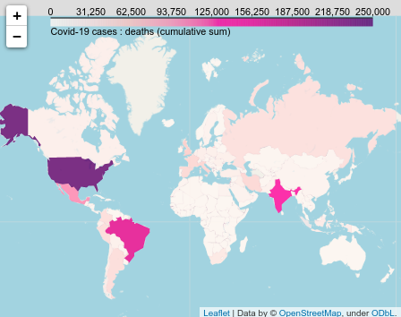

# CoCoA release 1.0

<section id="downloads" class="clearfix">
  <a href="https://github.com/tjbtjbtjb/CoCoA/zipball/master" id="download-zip" class="button"><span>Download .zip</span></a>
  <a href="https://github.com/tjbtjbtjb/CoCoA/tarball/master" id="download-tar-gz" class="button"><span>Download .tar.gz</span></a>
  <a class="buttons github" href="https://github.com/tjbtjbtjb/CoCoA">View On GitHub</a>
</section>

April/November 2020

* Tristan Beau - [UFR de Physique](https://physique.u-paris.fr/) - [Université de Paris](http://u-paris.fr) - [LPNHE laboratory](http://lpnhe.in2p3.fr/)
* Julien Browaeys - [UFR de Physique](https://physique.u-paris.fr/) - [Université de Paris](http://u-paris.fr) - [MSC laboratory](http://www.msc.univ-paris-diderot.fr/)
* Olivier Dadoun - [CNRS](http://cnrs.fr)/[IN2P3](http://www.in2p3.fr) - [LPNHE laboratory](http://lpnhe.in2p3.fr/)

The CoCoA project (Covid Collaborative Analysis) is a Python™ framework which provides a simplified and unified access to various Covid related databases.
It's designed to offer to many people (non-specialist general public, school pupils, students, science journalists, but also scientists who are not specialists in  computing and data access methods) a simple and practical tool for studying data : raw data access, time series plots, maps.
Then, it's easy to make simple or more complex analysis.
Database access difficulties, method unification, geo-localisation of data, are processed transparently.

Thus, in only few lines of code, with almost no Python™ knowledge, one can produce a plot or a map.
For example, after a [CoCoA install](https://github.com/tjbtjbtjb/CoCoA/wiki/Install) :

```python
import cocoa.cocoa as cc
cc.plot(where=['France','Italy'],which='confirmed',what='Cumul')
cc.map(where=['European Union','United kingdom'])
```

produce on the one hand a temporal serie plot of Covid confirmed cases for two countries (France and Italy as an example), or the deaths map with the European Union and United Kingdom.

 

CoCoA is made to work :
- locally (local install of Python™, for example with [`Spyder`](https://www.spyder-ide.org/) )
- on `Jupyter` platform, either closed or opened such as [`Google Colab`](https://colab.research.google.com/)
- through a `docker`, using for example [`mybinder`](https://mybinder.org/).

The full documentation is available on [the Wiki](https://github.com/tjbtjbtjb/CoCoA/wiki/Home).

The reference library is available using the `help` of function (see `help_*` [notebook files](https://github.com/tjbtjbtjb/CoCoA/tree/master/notebooks)) or on related pages : 
- [`cocoa` frontend](http://tjbtjbtjb.github.com/CoCoA/help_cocoa)
- [`covid19` databases access](http://tjbtjbtjb.github.com/CoCoA/help_covid19)
- [`display` tools of CoCoA](http://tjbtjbtjb.github.com/CoCoA/display)
- [`geo` tools for country name management](http://tjbtjbtjb.github.com/CoCoA/help_geo)
- [`error` tools](http://tjbtjbtjb.github.com/CoCoA/help_error)
- [`tools` with usefull function for the project](http://tjbtjbtjb.github.com/CoCoA/help_tools)
